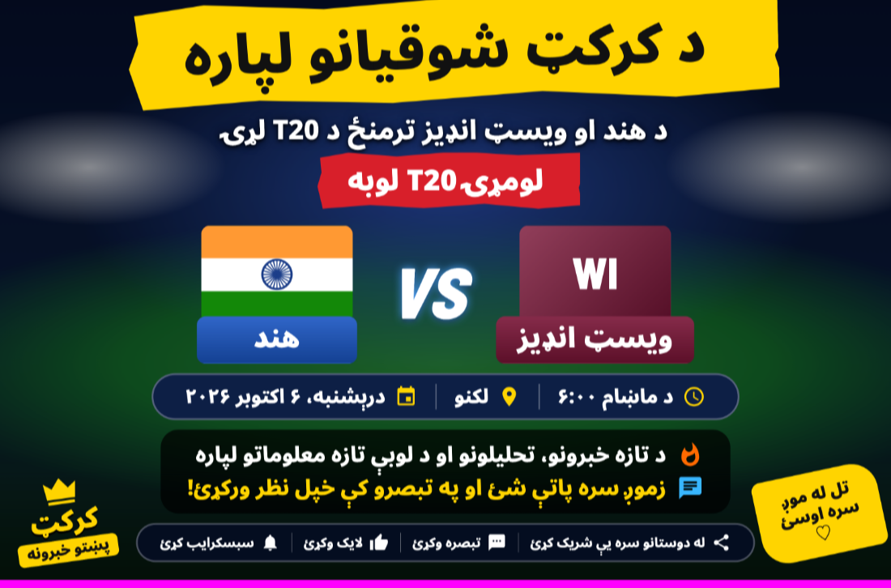
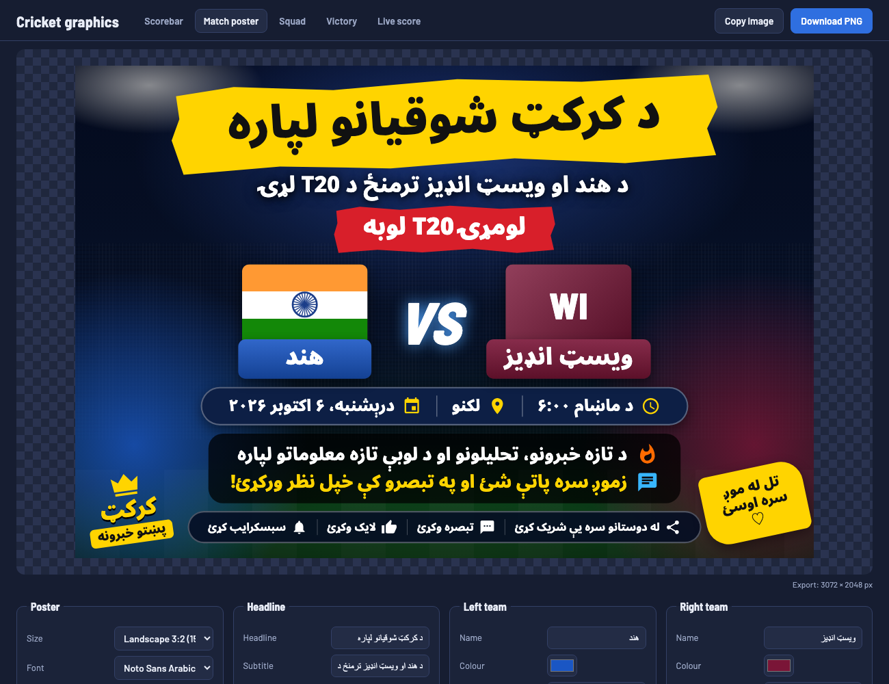
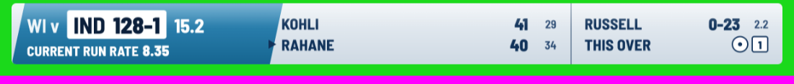
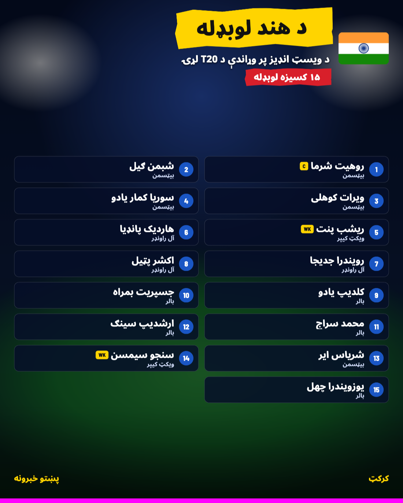
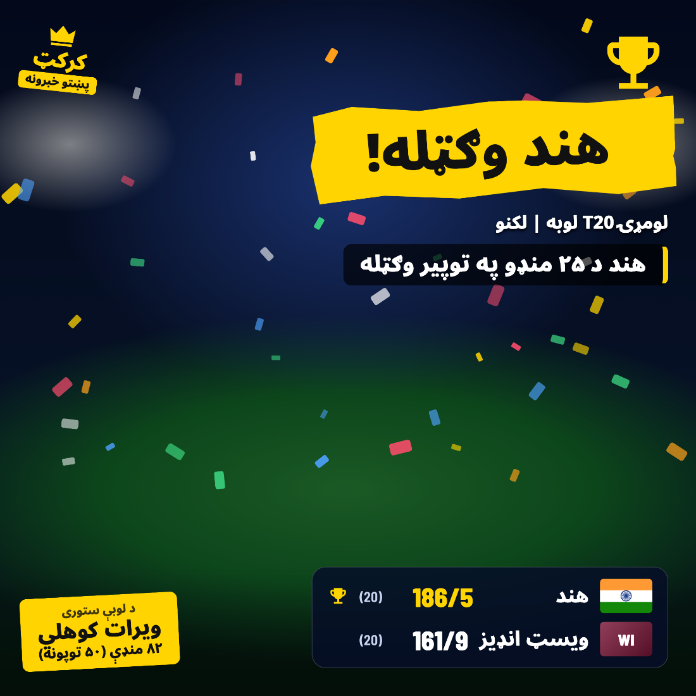
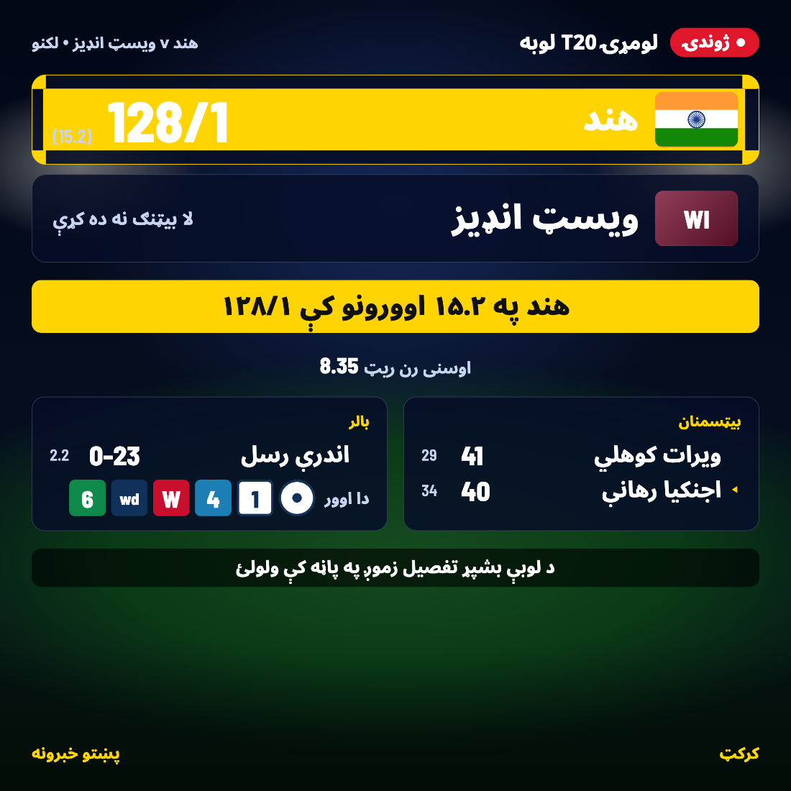
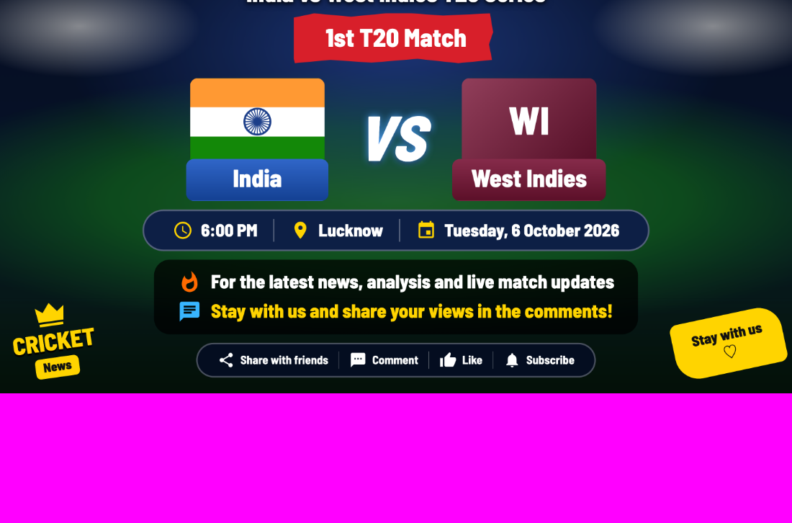

# Cricket Graphics Studio

Browser-based editor for cricket social-media and broadcast graphics. Open one HTML file, type in the match details (in Pashto, Dari, Urdu, English or any other language), and export a crisp PNG. No build step, no server, no account.



Five graphics live under one roof, each with its own tab:

| Tab | What it makes | Default size |
|---|---|---|
| **Scorebar** | Broadcast-style score bar for a stream or video overlay, with chroma-key or transparent background | 1200 × 96 px |
| **Match poster** | Fixture announcement with two player cutouts, flags, VS, time / venue / date pills, promo lines, call to action, brand and sticker | 1536 × 1024 |
| **Squad** | Team squad announcement with numbered player cards, roles, captain and keeper tags, optional captain cutout | 1080 × 1350 |
| **Victory** | Result post with brush-stroke headline, result line, mini scorecard, player of the match and confetti | 1080 × 1080 |
| **Live score** | Live score update card with both innings, status line, run rates, batters, bowler and this-over balls | 1080 × 1080 |

Every text, colour, flag, image and toggle in each design is editable. Each poster has a Language selector: Pashto gives right-to-left layouts with Arabic-script fonts, English gives left-to-right layouts with a Latin font, and every layout mirrors correctly in both.

---

## Table of contents

- [Quick start](#quick-start)
- [The graphics](#the-graphics)
  - [Scorebar](#scorebar)
  - [Match poster](#match-poster)
  - [Squad](#squad)
  - [Victory](#victory)
  - [Live score](#live-score)
- [Common controls](#common-controls)
- [Ball notation](#ball-notation)
- [Flags](#flags)
- [Player cutouts and photos](#player-cutouts-and-photos)
- [Exporting](#exporting)
- [Using the PNGs in OBS, vMix, or a video editor](#using-the-pngs-in-obs-vmix-or-a-video-editor)
- [Saving and reusing designs](#saving-and-reusing-designs)
- [Customising the look](#customising-the-look)
- [How it works](#how-it-works)
- [Browser support](#browser-support)
- [Privacy](#privacy)
- [Known limitations](#known-limitations)
- [Project structure](#project-structure)
- [Contributing](#contributing)
- [License](#license)

---

## Quick start

1. Clone or download this repository.
2. Double-click `index.html` to open it in Chrome, Edge, Safari or Firefox.
3. Pick a tab in the header, edit the fields under the preview.
4. Click **Download PNG** (or **Copy image**).

An internet connection is needed the first time so the browser can fetch the web fonts and the html2canvas library.



### Hosting it

It is a static site, so any static host works:

```bash
python3 -m http.server 8000
# then open http://localhost:8000/
```

For GitHub Pages or Netlify, publish the folder as-is. Each tab has a URL hash, so `…/index.html#live` opens the live score card directly.

---

## The graphics

### Scorebar



The original broadcast bar. Team block with flags, boxed score and overs, run rate and target line, two batters with an on-strike marker, bowler figures and a ball-by-ball "this over" tracker, plus an optional bottom strip.

| Panel | Fields |
|---|---|
| Batting team | Short name, score, overs, block colour, flag, flag upload |
| Bowling team | Short name, flag, flag upload, initials colour, show flags |
| Second line | Current run rate and runs required, each with label, value and toggle |
| Batters | Two names with runs and balls, on-strike selector |
| Bowler panel | Name, figures, overs, over label, balls (see [Ball notation](#ball-notation)) |
| Bottom strip | Left, centre and right text. "vs" is dimmed automatically |
| Background | Green screen, blue screen, black, transparent PNG, or a custom colour |

The export adds an 18 px margin so the drop shadow is not clipped, which is why a 1× export is 1236 px wide.

### Match poster

The fixture announcement shown at the top of this page. Built to match the common "player left, player right, flags and VS in the middle" social layout.

| Panel | Fields |
|---|---|
| Headline | Headline (yellow brush), subtitle, badge (red brush) with colour, centre text (VS) |
| Left team / Right team | Name, colour, flag, initials, flag image, player cutout, cutout size, horizontal offset, mirror |
| Match details | Time, venue, date pills with icons. Empty fields drop their pill |
| Promo lines | Two lines with fire and chat icons |
| Call to action | Share, comment, like and subscribe labels |
| Brand | Name, tagline and optional logo in the bottom-left corner |
| Corner sticker | Rotated yellow sticker in the bottom-right corner |
| Background | Stadium lights (built in), uploaded photo or solid colour, darken slider, accent colour, team-colour splashes |

Team names sit on colour cards under the flags. The headline brush uses the accent colour. Players sit behind the text so long headlines never get hidden.

### Squad



Paste the squad in the **Players** box, one per line:

```
Rohit Sharma | Batter (c)
Rishabh Pant | Wicket-keeper (wk)
Hardik Pandya | All-rounder
```

The text before `|` is the name, the text after it is the role. `(c)` adds a captain tag, `(wk)` a keeper tag, `(c/wk)` both. The tag labels are editable so you can write them in your own language.

Columns are chosen automatically from the player count, or fixed at 1 to 3. Numbers and roles can be hidden. The optional **Captain cutout** places a player image on the side and narrows the grid to make room.

### Victory



| Panel | Fields |
|---|---|
| Headline | Headline brush, subtitle, result line, trophy and confetti toggles |
| Team A / Team B | Name, colour, flag, initials, flag image, score and overs |
| Scorecard | Winner selector. The winner is listed first with a trophy and highlighted score, and the splashes take the winner's colour |
| Player of the match | Title, name, figures line, player cutout with size, offset and mirror |
| Brand, Background | As above |

The player of the match card and cutout sit opposite the text, so the layout stays balanced in both right-to-left and left-to-right.

### Live score



Designed for posting during a match. Update a few fields, export, post, repeat. Edits are autosaved so the card is ready when the next over ends.

| Panel | Fields |
|---|---|
| Header | Live badge text, match title, series / venue, footer line |
| Team A / Team B | Name, colour, flag, initials, score, overs, note (for example "Yet to bat") |
| Match situation | Which team is batting (highlights that row), status line, current and required run rate with labels |
| Batters | Panel title, two batters with runs and balls, on-strike selector |
| Bowler | Panel title, name, figures, overs, this-over label and balls |
| Brand, Background | As above |

A team with no score shows its note instead. Empty run-rate values hide themselves.

---

## Common controls

Every poster tab starts with a **Poster** panel:

| Control | Effect |
|---|---|
| Language | Pashto or English. Switching sets the text direction, font and digits for that language and translates any sample text you have not edited. Your own edits are kept |
| Size | Landscape 3:2, Landscape 16:9, Square 1:1, Portrait 4:5 or Story 9:16. Layouts adapt to the aspect ratio |
| Font | Noto Sans Arabic, Noto Kufi Arabic, Noto Naskh Arabic, Lalezar, or Barlow Semi Condensed for Latin text |
| Text direction | Right to left or left to right. Icon order, alignment and mirrored arrows follow this |
| Digits | Western 0-9 or Eastern Arabic ۰-۹. Applied to scores, overs, numbers and dates you type in Western digits |
| Text size | 70% to 130% scaling of all text in the design |

Every tab ends with **Export and design file**: resolution (1×, 2×, 3×), **Save design (JSON)**, **Load design**, and **Reset to sample**. The caption under the preview always shows the exact pixel size of the export.

### English and other left-to-right posts

Choose **English** in the Language selector and the whole design flips to left-to-right: text aligns left, icon order reverses, the squad flag and victory scorecard move to the left, the striker arrow points right, and the Latin font Barlow Semi Condensed is used. The direction, font and digit selectors stay editable afterwards, so you can mix, for example, English text with Eastern Arabic digits.



To add another language, add an entry to `LANGS` in `js/core.js` (direction, font, digits) and a matching block in the `TEXT` table at the top of each poster module.

---

## Ball notation

The scorebar and live score card share the same ball-by-ball tracker. Type balls separated by spaces, for example `0 1 4 W wd 6`.

| Token | Rendered as |
|---|---|
| `0` or `.` | A round dot ball |
| `1`, `2`, `3`, `5` | A square showing the number |
| `4` | A blue square |
| `6` | A green square |
| `W` | A red square (wicket) |
| `wd`, `nb`, `lb`, `b`, `ro` | A dark square with the lowercase abbreviation |
| Anything else | A plain square showing the text as typed |

Tokens are case-insensitive. The scorebar shows up to 10 balls and the live card up to 12.

---

## Flags

Each team has a flag selector with the same options everywhere:

- **Built in:** India, Pakistan, Afghanistan, Bangladesh, England. These are drawn in CSS and SVG, so they stay sharp at any size. Afghanistan and Pakistan are simplified (no emblem detail).
- **Solid block with initials:** a gradient in the team colour with up to three letters. The **Initials** field sets the letters; if it is empty the first letters of the name are used.
- **Uploaded image:** any image file. Uploading switches the selector to this mode automatically.

Any other team: upload a flag image.

---

## Player cutouts and photos

The match poster, squad and victory designs accept player images. For the broadcast look, use a PNG with a transparent background (a "cutout"). Free tools such as remove.bg or the background remover in Canva, Photoshop or Photopea produce these in one click.

Each cutout has three controls:

- **Size** scales the image as a percentage of the poster height (or of the player band in portrait formats).
- **Offset** nudges it towards or away from the edge.
- **Mirror** flips it so both players face the centre.

The background **Photo** option accepts any stadium or crowd image. Use the **Darken** slider to keep text readable over it.

---

## Exporting

**Download PNG** renders the active graphic off-screen at the chosen resolution and saves a file named after the design, for example `match-poster-هند-vs-ویسټ-انډیز.png` or `scorebar-ind-vs-wi.png`.

**Copy image** puts the same PNG on the clipboard so it can be pasted into a post, chat or image editor.

Poster exports are full-bleed with no margin. Scorebar exports have an 18 px margin and use the chosen background, or a true alpha channel when **Transparent** is selected.

If rendering fails, the status text in the header suggests dropping to a lower resolution. A 3× story export is 3240 × 5760 px and takes a few seconds.

---

## Using the PNGs in OBS, vMix, or a video editor

**Scorebar.** Choose **Transparent (PNG)** and add the file as an image source. No keying needed and the drop shadow is preserved. Use green or blue screen only when your workflow expects a keyed graphic.

**Updating during a match.** Keep the editor open. After each over, update the scorebar or live score fields and export with the same team names so the file name stays the same. Most streaming tools reload image sources automatically when the file changes on disk.

---

## Saving and reusing designs

- **Autosave.** Every tab saves its state in the browser's local storage as you type, including uploaded images when they fit. Reloading the page brings everything back. If the images are too large to store, the text is still saved and the images need re-uploading.
- **Save design (JSON)** downloads the full state of the current tab, images included, as a `.json` file. Use it as a template per series or to move a design to another computer.
- **Load design** restores a saved file. Missing fields fall back to the sample, so older files keep working after updates.
- **Reset to sample** returns the tab to the built-in India v West Indies example.

---

## Customising the look

| Want to change | Where |
|---|---|
| Editor colours and fonts | `:root` variables at the top of `css/app.css` |
| Scorebar colours, ink, gradient | `css/scorebar.css` and the `.ball` rules in `css/app.css` |
| Poster layouts, brush shape, pills, cards | `css/posters.css`, one block per design (`.mp`, `.sq`, `.vc`, `.lv`) |
| Built-in stadium background | `.poster .bglights`, `.crowd` and `.pitch` in `css/posters.css` |
| Default sample text and colours | The `sample()` function at the top of each module in `js/` |
| Available fonts | The Google Fonts `<link>` in `index.html` and `FONTS` / `FONT_STACKS` in `js/core.js` |
| Available sizes | `SIZES` in `js/core.js` |
| Built-in flags | `js/flags.js` plus the `.flag-*` rules in `css/app.css` |
| Icons | `js/icons.js` (24 × 24 SVG paths) |

Poster dimensions use CSS container units (`cqw`, `cqh`), so every measurement scales with the chosen size. Replace the web fonts with locally installed ones and the app works fully offline.

### Adding a new graphic

Each design is one file in `js/` that calls `App.register({...})` with:

- `id`, `tab` and a `sample()` function returning the default state;
- `size(S)` returning the artwork size in pixels;
- `groups`, a declarative list of form panels (`text`, `textarea`, `select`, `check`, `color`, `range`, `image`, `hint` fields, or a `pair` of two inputs);
- `template`, the HTML of the artwork;
- `render(S, root)`, which writes state into the template.

The engine builds the form, binds inputs by dotted path (`a.name`, `bat.0.runs`), handles image uploads, scales the preview, autosaves and exports. Add a `<script>` tag for the new file in `index.html` and it appears as a tab.

---

## How it works

- **State.** Each tab owns a plain object. Every input has a `data-k` path into it. On input the value is written and the whole artwork is re-rendered. There is no framework.
- **Preview scaling.** Artwork is laid out at full size and CSS-transformed to fit the window, so the preview is pixel-faithful to the export.
- **Export.** The artwork is cloned off-screen and rasterised by [html2canvas](https://html2canvas.hertzen.com/) at the chosen scale. The page waits for `document.fonts.ready` first so web fonts are in place. Designs avoid CSS that html2canvas cannot draw (filters, clip-path, object-fit), which is why brush strokes are inline SVG and cutouts are background images.
- **Right-to-left.** The poster root carries `dir`, text spans use `dir="auto"`, and layout uses logical properties where mirroring matters. Letter spacing is zero inside posters so Arabic-script shaping is never broken.

---

## Browser support

| Browser | Edit and preview | Download PNG | Copy image |
|---|---|---|---|
| Chrome / Edge (desktop) | Yes | Yes | Yes |
| Safari (macOS) | Yes | Yes | Yes |
| Firefox | Yes (110+) | Yes | Yes in Firefox 127 and later |
| Mobile browsers | Yes | Yes | Varies |

Poster layouts need CSS container queries (Chrome 105+, Safari 16+, Firefox 110+).

---

## Privacy

Nothing leaves your browser. Uploaded images are read into page memory and, when small enough, your browser's local storage. The only network requests are to Google Fonts and the cdnjs copy of html2canvas, both made by the browser when the page loads. There is no analytics, tracking or form submission.

---

## Known limitations

- **Needs internet on first load** for the web fonts and html2canvas. Vendor both locally for an offline kit.
- **Large images may not autosave.** Browsers cap local storage at around 5 MB. Text is always saved; use **Save design (JSON)** to keep images with a design.
- **Built-in flags cover five teams.** Others need an uploaded image.
- **Very long names** can overflow cards. Use short names and the **Text size** slider.
- **html2canvas approximates the browser renderer.** Exotic CSS added during customisation may not export identically.

---

## Project structure

```
cricket-scorebar-editor/
├── index.html              # Shell: header, tabs, script and style includes
├── css/
│   ├── app.css             # Editor UI, shared flag and ball styles
│   ├── scorebar.css        # Broadcast scorebar
│   └── posters.css         # Match, squad, victory and live score designs
├── js/
│   ├── core.js             # Engine: state binding, form builder, preview, autosave, export
│   ├── icons.js            # Inline SVG icons
│   ├── flags.js            # Flag renderer
│   ├── poster-common.js    # Background layers, brand, splash and cutout helpers
│   ├── scorebar.js         # Scorebar tab
│   ├── match-poster.js     # Match poster tab
│   ├── squad-poster.js     # Squad tab
│   ├── victory-poster.js   # Victory tab
│   └── live-poster.js      # Live score tab
├── docs/                   # Screenshots used in this README
└── README.md
```

---

## Contributing

Issues and pull requests are welcome. Please:

1. Keep the app dependency-free beyond the existing CDN resources.
2. Keep designs within what html2canvas can render (no `filter`, `clip-path`, `object-fit`, `mix-blend-mode` or `backdrop-filter`).
3. Test an export in at least one Chromium browser and one of Safari or Firefox, in both text directions.

---

## License

No license file has been added yet. Until one is, all rights are reserved by the author. If you intend to share or accept contributions, consider adding an [MIT](https://choosealicense.com/licenses/mit/) or similar license.
